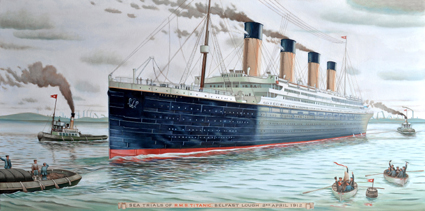

# Welcome to my data portfolio!

This repository is a collection of my various data analysis projects. The repo is basically only Python and SQL, all written in JupyterLab. I do wrangling, exploratory data analysis, and I'm getting into statistical analysis as well.

Below is a short summary of each project in the repo. Feel free to check them out, and do come back again later to find new projects!

 ## 🎮 [A Deep Dive Into The Tomb Raider Fanbase](https://github.com/NicolaBagala/portfolio/tree/master/tomb_raider_survey)

<i><b>Tech used:</b> JupyterLab, Python, Pandas, Matplotlib, SciPy, Google Sheets, Google Forms</i>

<table>
    <tr>
        <td width="35%" valign="top">
            
        </td>
        <td valign="top">
            
As a fan of the <i>Tomb Raider</i> franchise, I'm well aware that its newest installments and their reimagination of Lara Croft's character have caused quite a splash and polarised the fanbase. To understand the extent of this polarisation and the opinions and preferences of the fans on both the games and their protagonist, I created a survey and shared it with the fanbase on Facebook, Reddit, Twitter, and so on. In this project, I analysed the results of the survey—some predictable, others quite surprising.

            

        </td>
    </tr>
<table>

## 🎬 [Movie Curiosities: An IMDB Exploration](https://github.com/NicolaBagala/portfolio/tree/master/imdb)

<i><b>Tech used:</b> JupyterLab, Python, Pandas, Matplotlib</i>

<table>
    <tr>
        <td width="35%" valign="top">
            
        </td>
        <td valign="top">
            
This project is an exploration of a custom-built movie dataset, created combining existing ones and other data that I had to look for on the Internet. As such, it was a rather huge wrangling & cleaning exercise, but it also revealed interesting trivia bits about movie budgets, profits, and user preferences.

            

        </td>
    </tr>
<table>

## 🎼 [SQL Demo](https://github.com/NicolaBagala/portfolio/tree/master/sql_demo)

<i><b>Tech used:</b> JupyterLab, SQLite, Python, Pandas</i>

<table>
    <tr>
        <td width="35%" valign="top">
            
        </td>
        <td valign="top">
            
This project is a fairly short one, intended as a demo of my SQL skills. I used the famous (I guess?) Chinook music store database, but I also created a very tiny database myself. I'm definitely going to do more with SQL, but hey, this is a start!

            

        </td>
    </tr>
<table>

## 🚢 [Women and Children First](https://github.com/NicolaBagala/portfolio/tree/master/titanic)

<i><b>Tech used:</b> JupyterLab, Python, Pandas, Matplotlib, Seaborn, BeautifulSoup</i>

<table>
    <tr>
        <td width="35%" valign="top" align="center">
            
        </td>
        <td valign="top">
            
Everyone does that project where you use machine learning on the <i>Titanic</i> passenger dataset to predict survivors, right? Well, I didn't. That would be unoriginal. Instead, I decided to build a more comprehensive dataset by adding the crew list (scraped off Wikipedia), and explore it to see what factors influenced the survival/death rates, particularly when looking at men and women separately, and I tested the results against a "shuffled" <i>Titanic</i> where survivors were chosen at random. (Turns out that tossing a coin would've given some people better chances of surviving.)

            

        </td>
    </tr>
<table>

