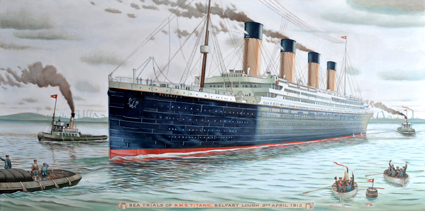

# Welcome to my data portfolio!

This repository is a collection of my various data analysis projects. The repo is basically only Python and SQL, all written in JupyterLab. I do wrangling, exploratory data analysis, and some statistical analysis as well.

Below is a short summary of each project in the repo. Feel free to check them out, and do come back again later to find new projects!

    <h2>📊 </h2>
    
<i><b>Tech used:</b> MS SQL Server, Tableau</i>
    
    

    
    This small project was an SQL exercise to practise working with large databases and familiarise with the newest version of MS SQL Server. I used a publicly available version of the StackOverflow database to pull some statistics about tags used to tag the website's questions, and visualised the result in Tableau.

    

            

    <h2>💲 </h2>
    
<i><b>Tech used:</b> JupyterLab, Python, Pandas, Matplotlib, SciPy, NumPy</i>
    
    

    
    This project focuses on statistical analysis to test hypotheses concerning medical insurance costs. Do male or female patients have higher medical expenses? Does body weight correlate with expenses in any way? What about age, or smoking? Those are the questions I set out to answer.

    

            

    <h2>🎮 </h2>
    
<i><b>Tech used:</b> JupyterLab, Python, Pandas, Matplotlib, SciPy, Google Sheets, Google Forms</i>
    
    

    
    As a fan of the <i>Tomb Raider</i> franchise, I'm well aware that its newest installments and their reimagination of Lara Croft's character have caused quite a splash and polarised the fanbase. To understand the extent of this polarisation and the opinions and preferences of the fans on both the games and their protagonist, I created a survey and shared it with the fanbase on Facebook, Reddit, Twitter, and so on. In this project, I analysed the results of the survey—some predictable, others quite surprising.

    

            

    <h2>🎬 </h2>
    
<i><b>Tech used:</b> JupyterLab, Python, Pandas, Matplotlib</i>
   
    

        
    This project is an exploration of a custom-built movie dataset, created combining existing ones and other data that I had to look for on the Internet. As such, it was a rather huge wrangling & cleaning exercise, but it also revealed interesting trivia bits about movie budgets, profits, and user preferences.

    

            

    <h2>🎼 </h2>
    <i><b>Tech used:</b> JupyterLab, SQLite, Python, Pandas</i>    
    

    
    This project is a fairly short one, intended as a demo of my SQL skills. I used the famous (I guess?) Chinook music store database, but I also created a very tiny database myself. I'm definitely going to do more with SQL, but hey, this is a start!

    

            

    <h2>🚢 </h2>
    <i><b>Tech used:</b> JupyterLab, Python, Pandas, Matplotlib, Seaborn, BeautifulSoup</i>    
    

    
    Everyone does that project where you use machine learning on the <i>Titanic</i> passenger dataset to predict survivors, right? Well, I didn't. That would be unoriginal. Instead, I decided to build a more comprehensive dataset by adding the crew list (scraped off Wikipedia), and explore it to see what factors influenced the survival/death rates, particularly when looking at men and women separately, and I tested the results against a "shuffled" <i>Titanic</i> where survivors were chosen at random. (Turns out that tossing a coin would've given some people better chances of surviving.)

    

    

