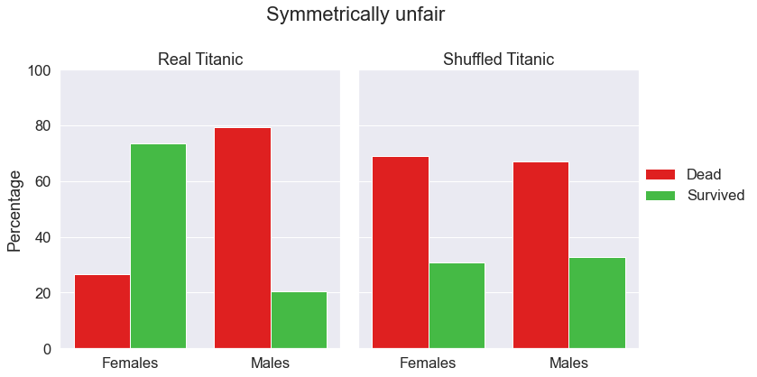
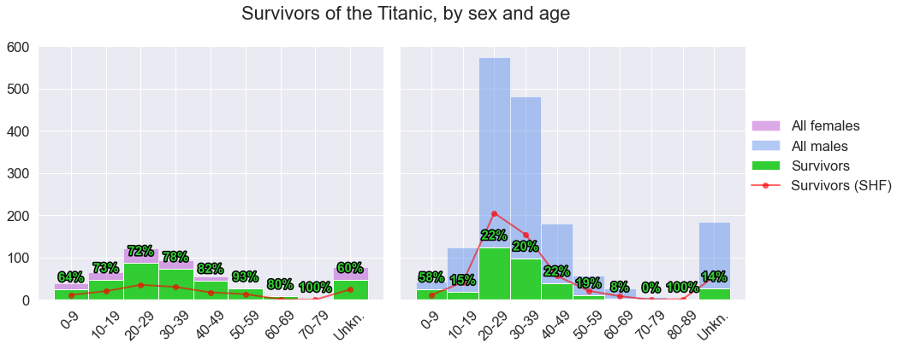
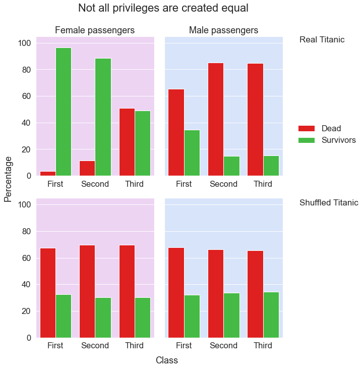
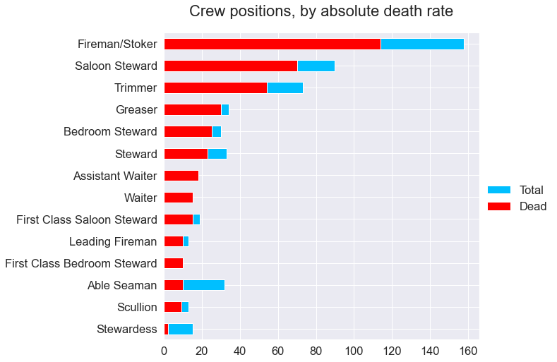

# Women And Children First

_**Tech used:** JupyterLab, Python, Pandas, Matplotlib, Seaborn, BeautifulSoup_

**Note:** This is a summary of the project results. The full project is available both with code ([wrangling](https://github.com/NicolaBagala/portfolio/blob/master/data/titanic/titanic_wrangling.ipynb) and [analysis](https://github.com/NicolaBagala/portfolio/blob/master/data/titanic/titanic_analysis.ipynb)) as well as [code-free](https://github.com/NicolaBagala/portfolio/blob/master/data/titanic/codefree/titanic_analysis_codefree.ipynb) (analysis only).

The goal of this project was to figure out whether the unwritten rule “women and children first” applied to the tragedy of the <i>Titanic</i>. Aside from simply checking whether more men or women died, I wanted to see whether the percentage of victims of either sex differ significantly when factors like age, class, affiliation (i.e., crew or passenger), etc, are taken into account. I compared my results to those observed on the “shuffled <i>Titanic</i>”, an imaginary ship with the same overall death rate but whose victims and survivors were chosen entirely at random. Below are some key highlights from the project.

<table>  
  <tr>
    <td align="justify">
      <h3>♂ <b>Sex matters</b></h3>
      
If sex had played no role in determining survival rates, you’d expect to see more or less the same percentages of victims and survivors among men and women—something we see on the shuffled <i>Titanic</i> on the right. But in reality, <b>vastly more women than men survived,</b> and the rates of survival and death for women is pretty much the opposite of what it’d look like in a scenario where sex isn’t relevant at all—the chart on the right.

      

        
      

    </td>    
  </tr>

  <tr>
    <td align="justify">
      <h3>📅 <b>Age makes little difference</b></h3>
      
No matter the age, <b>survival rates for women on the <i>Titanic</i> were always extremely high,</b> and much higher than they’d be (red line) if sex didn’t matter. Barring few exceptions, <b>male survival rates were no higher than 22% across all cohorts.</b> If survival had been randomly determined, almost all male cohorts would be better off.

      

        
      

    </td>    
  </tr>

  <tr>
    <td align="justify">
      <h3>🎩 <b>Class matters... depending on sex</b></h3>
      
Overall, <b>higher-class passengers had higher survival rates,</b> but once again, sex played a big role in determining the outcomes. <b>For women, higher class meant much lower risk of death;</b> for men, the difference was little-to-none. No such distinction exists on the shuffled <i>Titanic</i>.

      

        
      

    </td>    
  </tr>  

<tr>
    <td align="justify">
      <h3>⚠ <b>The most dangerous jobs on the <i>Titanic</i></b></h3>
      
Predictably, people working in the ship’s engineering section had the highest absolute death count, though not in percentage terms. Much smaller groups, like waiters, had a 100% fatality rate. One could argue that, given the small number of waiters, this was just bad luck. Yet stewardesses had the least fatalities both count- and percentage-wise, despite their group size was comparable to many others with much higher fatality rates—<b>a pattern that repeats itself over and over for women in the analysis.</b>

      

        
      

    </td>    
  </tr>
 
</table>

If you'd like to dig deeper in the details of the project, pick your flavour and take a look at the full project:

  
- [analysis notebook](https://github.com/NicolaBagala/portfolio/blob/master/data/titanic/titanic_analysis.ipynb);
- [code-free](https://github.com/NicolaBagala/portfolio/blob/master/data/titanic/codefree/titanic_analysis_codefree.ipynb) analysis notebook;
- [data wrangling notebook](https://github.com/NicolaBagala/portfolio/blob/master/data/titanic/titanic_wrangling.ipynb).
        

