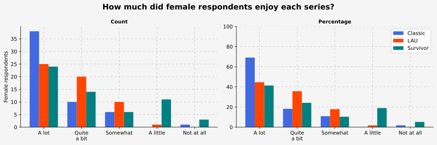
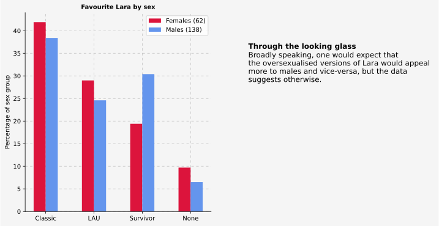
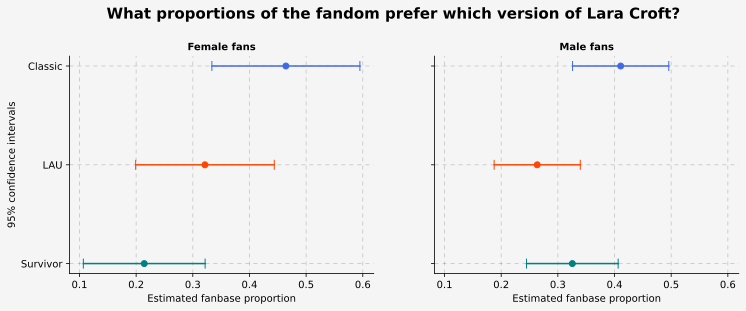
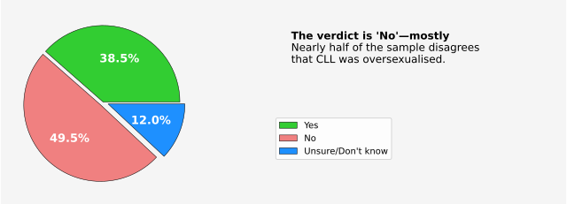
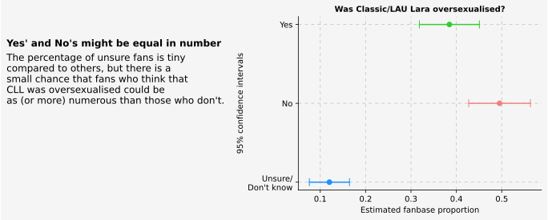

# A Deep Dive Into The *Tomb Raider* Fanbase

_**Tech used:** JupyterLab, Python, Pandas, Matplotlib, SciPy, Google Sheets, Google Forms_

**Note:** This is a summary of the project results. Click [here](https://github.com/NicolaBagala/portfolio/blob/master/tomb_raider_survey/tr_survey.ipynb) for the full project with code, or [here](https://github.com/NicolaBagala/portfolio/blob/master/tomb_raider_survey/codefree/tr_survey_codefree.ipynb) for a code-free version of the full project.

The <i>Tomb Raider</i> franchise, which revolves around the adventures of archaeologist Lara Croft, has seen a number of reboots and revamps of its main character over the years. Sometimes, the differences are small—like those between the Classic and LAU series; in other cases, the differences are quite big, like in the case of the Classic and <i>Survivor</i> series. As a fan myself, I was interested in understanding the preferences of the fanbase not only for different series, but also for the three different versions of Lara. More precisely, I wanted to find an answer to three main questions:

<ol>
  <li>Many think that Lara's exaggerated sex appeal in Classic and LAU games made both the games and the character unlikeable to female players. <strong>Is it true? Do they prefer Survivor Lara and/or <i>Survivor</i> games?</strong></li>
  <li>Another common assumption is that Classic/LAU Lara looked the way they did to please straight male players. If that's true, <strong>do straight males prefer Classic/LAU Lara over the much more average-looking Survivor Lara?</strong></li>
  <li><strong>Does the fandom agree that Classic/LAU Lara was oversexualised?</strong></li>
</ol>

To figure it all out, I ran a survey and analysed the results. In this summary, I'll briefly discuss only the results concerning the three questions above; if you're interested, the full project goes into a lot more detail.

<strong>Female respondents definitely <i>did</i> enjoy Classic and LAU games, and they did so more than they enjoyed <i>Survivor</i> games.</strong> The chart below illustrates this both in absolute and percentage terms: when the measure of game enjoyment is positive or neutral (answers <i>A lot</i>, <i>Quite a bit</i>, and <i>Somewhat</i>), <i>Survivor</i> games are always trailing behind Classic or LAU games (or both); when the measure is negative (answers <i>A little</i> and <i>Not at all</i>), they always "beat" the other two series, so to speak.  

  

In terms of which sex prefers which version of Lara, the sample data is unequivocal that, surprisingly, <strong>female players who prefer Classic and LAU Lara (the allegedly "oversexualised" versions of Lara!) are more than those who prefer Survivor Lara;</strong> Classic Lara is the favourite of both female and male players, but interestingly, more male players prefer Survivor Lara over LAU Lara, and in percentage, <strong>a fair bit more male players than female players prefer Survivor Lara!</strong> (The full project digs deeper into this, accounting for the sexual orientation of the respondents.)  

  

A statistical analysis of this result revealed that, with 95% confidence, <strong>Classic Lara is likely the favourite of both male <i>and</i> female fans in general.</strong> Unfortunately, the sample wasn't large enough to produce smaller confidence intervals; there's often significant overlap, and therefore the estimated proportions below aren't as accurate as they could be. But even so, <strong>in the case of female players, there's no overlap between the intervals of Survivor and Classic Lara,</strong> making it unlikely that Survivor Lara might be the ladies' favourite. <strong>For male players, instead, the overlap makes it quite possible that Survivor Lara might be the winner.</strong> Only a survey with more respondents may answer this question, but in any case, these results fly right in the face of commonly held assumptions about Lara Croft and her fanbase's preferences.  

  

The final question, i.e. whether Classic/LAU Lara (CLL for short) was oversexualised, is pretty much settled according to the respondents: <strong>No, she was not,</strong> said a staggering 49.5% of the respondents. (If you browse the full project, you'll see that males and females picked every option in nearly identical percentages.)  

  

However, inference on these results revealed that it's still possible that, at the fandom level, the answer might instead be "Yes", as shown by the overlap of the confidence intervals below.  

  

This isn't but a fraction of the full project; if you want to read more, have a look at the  or its  version, if you couldn't care less about code!

  

