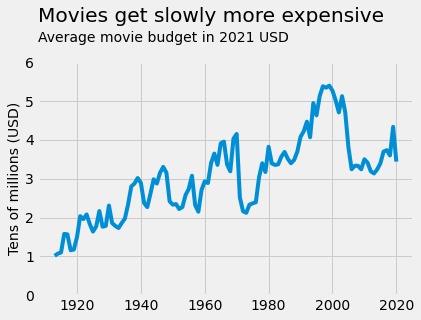
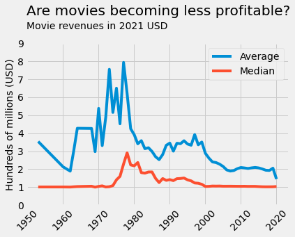
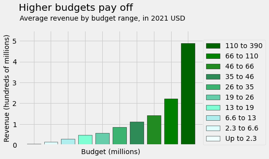
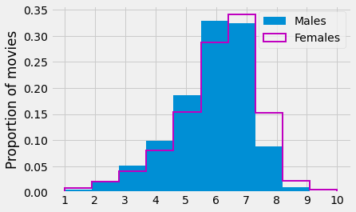

# Movie Curiosities: An IMDB Exploration

_**Tech used:** JupyterLab, Python, Pandas, Matplotlib_

This project was one of my oldest, intended as a through exercise in data collection, cleaning, and wrangling as well as data exploration. Using different data sources, I put together an “enhanced” IMDB database containing information about nearly 90.000 movies from the past 120-ish years, and explored it in search of interesting movie trivia. Here’s a few examples.

<table>  
  <tr>
    <td width="40%" align=justify><h3>📈 <b>Movie budgets go up...</b></h3>On average, <b>movies got more and more expensive</b> to make as years went by. Until about 1980, the same was true for movie revenues worldwide, but at that point, something funny seems to have happened.</td>
    <td align=center></td>
  </tr>

  <tr>
    <td align=center></td>
    <td width="40%" align=justify><h3>📉 <b>...but revenues go down.</b></h3><b>The average movie revenue started plummeting in the late 1970s,</b> showing little sign of recovery, if any. Even the median revenue, which had been mostly the same throughout the century, went up considerably and then flattened out again. What was going on here?</td>
  </tr>
  
  <tr>    
    <td width="40%" align=justify><h3>🤑 <b>Spend more, earn more</b></h3>Movies have been getting more complex and expensive to make, but spending more on a movie may be an investment: <b>worldwide revenues go up significantly as the budget grows.</b></td>
    <td align=center></td>
  </tr>  
  
  <tr>
    <td align=center></td>
    <td width="40%" align=justify><h3>🤔 <b>Are men pickier than women?</b></h3>Compared to men, <b>women give low scores to a smaller proportion and high scores to a higher proportion of movies</b> with astonishing consistency. Are men pickier?</td>    
  </tr>
</table>

### 😀 Curious to learn more? 
  
In this repository, you will find:  
- The [data exploration notebook](https://github.com/NicolaBagala/portfolio/blob/master/imdb/imdb_exploration.ipynb),
- the [code-free](https://github.com/NicolaBagala/portfolio/blob/master/imdb/codefree/imdb_exploration_codefree.ipynb) data exploration notebook, and
- the [data wrangling notebook](https://github.com/NicolaBagala/portfolio/blob/master/imdb/imdb_wrangling.ipynb).
        
Feel free to clone the repository, if you like!
