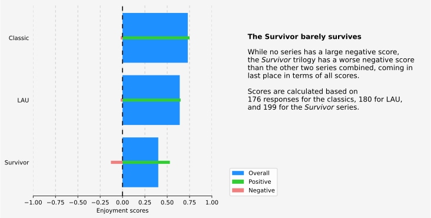
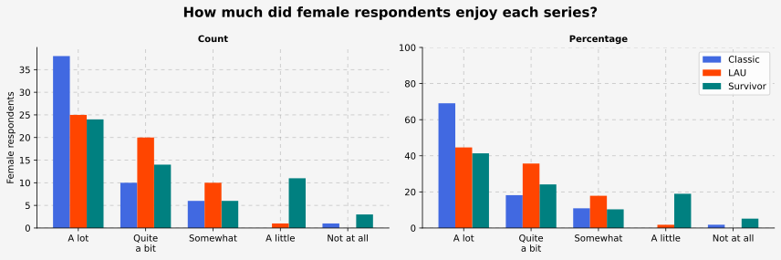
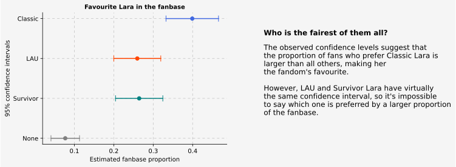
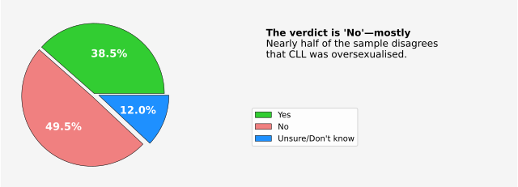
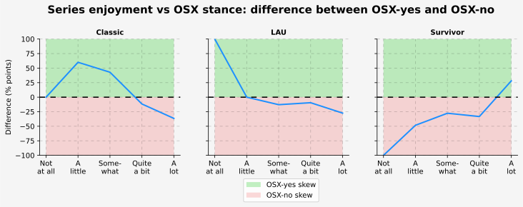

# A Deep Dive Into The Tomb Raider Fanbase

_**Tech used:** JupyterLab, Python, Pandas, Matplotlib, SciPy, Google Sheets, Google Forms_

The *Tomb Raider* franchise, which revolves around the adventures of archaeologist Lara Croft, has seen a number of reboots and revamps of its main character over the years. Sometimes, the differences are small—like those between the Classic and LAU series; in other cases, the differences are quite big, like in the case of the Classic and *Survivor* series. As a fan myself, I was interested in understanding the preferences of the fanbase not only for different series, but also for the three different versions of Lara. Additionally, I wanted to see what her fans think of one of the most hotly debated topics in videogame history: was Lara Croft oversexualised?

To figure it all out, I ran a survey and analysed the results. Below are some of the most interesting findings; if you want to read them in full, check the bottom of this page.

<table>  
  <tr>
    <td align=justify>
      <h3>📀 <b>Oldie but goldie</b></h3>
      
Classic <i>Tomb Raider</i> games are decades old and far more advanced than the modern <i>Survivor</i> series. Yet, according to the survey respondents, <b>the Classic series is more enjoyable than the <i>Survivor</i> series</b> by quite some margin. 

      

        
      

    </td>    
  </tr>

  <tr>
    <td align="justify">
      <h3>♀️ <b>What do the ladies think?</b></h3>
      
Despite persistent claims that female players didn’t like very much the older Classic and LAU series because of the way Lara looked in them, the sample shows that <b>they like them much more than they like the <i>Survivor</i> series</b>.

      

        
      

    </td>    
  </tr>

  <tr>
    <td align="justify">
      <h3>🥇 <b>And the winner is...</b></h3>
      
Even after all these years, <b>Classic Lara seems to be still the fandom’s favourite</b>—with 95% confidence anyway.

      

        
      

    </td>    
  </tr>  

  <tr>
      <td align="justify">
        <h3>🤔 <b>Were Classic and/or LAU Lara oversexualised?</b></h3>
        
By and large, <b>the sample doesn’t think so, and probably neither does most of the fandom.</b> But there’s more than meets the eye...</b>

        

          
        

      </td>    
  </tr>

  <tr>
      <td align="justify">
        <h3>🐟 <b>Something fishy is going on...</b></h3>
        
<b>Respondents who like Classic and LAU games more tend to say Classic/LAU Lara wasn’t oversexualised</b> (`OSX-no`) in increasing percentages. Similarly, <b>the higher the enjoyment of <i>Survivor</i> games, the higher the percentage of respondents who say Classic/LAU Lara was oversexualised.</b> (`OSX-yes`). Bias much?

        

          
        

      </td>    
  </tr>
 
</table>

### 😀 Curious to learn more? 
  
In this repository, you will find:  
- The [analysis notebook](https://github.com/NicolaBagala/portfolio/blob/master/tomb_raider_survey/tr_survey.ipynb), and
- the [code-free](https://github.com/NicolaBagala/portfolio/blob/master/tomb_raider_survey/codefree/tr_survey_codefree.ipynb) analysis notebook.
        
Feel free to clone the repository, if you like!
