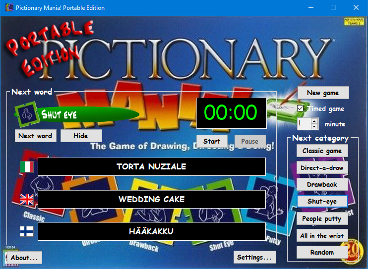

# Visual Basic projects

Visual Basic was nearly my first encounter with programming (the first one was Quick Basic, really), and it's probably the language I have worked with the most for hobby projects. Unfortunately, they were all pretty much built before the Git age and nearly all were lost over the years. In this repository, I'll store my new Visual Basic projects and any older ones that I still have.

    <h2>🖊 </h2>
    
<i><b>Tech used:</b> MS Visual Studio 2022, MS Visual Basic.NET, Adobe Photoshop</i>
    
    

    
    This is a trilingual app that I built in 2010, and then refactored in 2022, to be able to play <i>Pictionary Mania!</i> without having to carry the game box around, and more importantly in a country where nearly no one speaks the language that my copy of the game is in. It's not quite like playing the real game, but it's more than enough to have a few laughs with friends.

    

            

