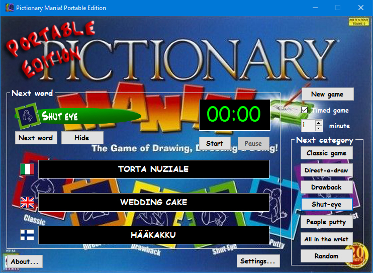

# Pictionary Mania! Portable Edition

_**Tech used:** MS Visual Studio 2022, MS Visual Basic.NET, Adobe Photoshop_

I'm a big fan of <a href="https://en.wikipedia.org/wiki/Pictionary"><i>Pictionary</i></a>, and even more so of <a href="https://boardgamegeek.com/boardgame/24118/pictionary-mania"><i>Pictionary Mania!</i></a>, a version of the game that expands on the original one by adding a bunch of crazy ways for players to draw and act out words for other players to guess. The only problem is, my version of the game is in Italian, and I live in Finland, so I couldn't really play with anyone here. To solve this problem, in 2010 I built <i>Pictionary Mania! Portable Edition</i> using Visual Basic 2005. The app doesn't reproduce the full game mechanics, but it does allow to randomly select words from all the six game categories, keep track of what words have already been used, and time your game. Additionally, the words are displayed in three languages, which solved my original problem.

In 2022, I picked up the project again and noticed the code was a bit of a mess; so, as an exercise, I decided to basically refactor the whole thing, making it more object-oriented than it was originally. Since the version of Visual Studio I used originally was in Italian, some of the project's auto-generated files have comments in Italian which I didn't bother translating, but my own code is commented in English. The interface is very intuitive and doesn't really require separate instructions.</a>

The app uses a little bit of the game's original box art, which I touched up with Photoshop to accommodate my needs, and a couple of free sounds. As this is basically just a word picker that does not reproduce the full experience of the real game, I do hope Mattel, Inc. (the game's copyright holder) doesn't decide to sue me over a programming exercise, but let me reiterate that a) I don't make any money out of this project, and b) no one is allowed to use it for commercial purposes. (Not that I imagine anyone would...) As a matter of fact, I do encourage everyone to go an get themselves a copy of the original game, because it's hilarious to say the least.

    

